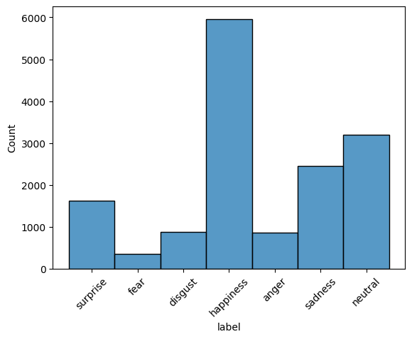
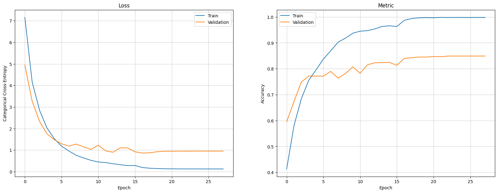

# facial-emotion-recognition-service

## 1. Project Outline
In this project we:
- trained a model on images of isolated human faces using deep learning techniques in order to recognize the emotions expressed
- used image segmentation libraries to isolate faces in _any_ image so we can perform the abovementioned classification task on each face
- made a web UI to expose the above functionalities in a user-friendly interface

## 2. Project Structure
We have the following repos in this project. Please check each repo's README for further details.
- [hfer](https://github.com/facial-emotion-recognition-service/hfer) for the back end
- [hfer_front](https://github.com/facial-emotion-recognition-service/hfer_front) for the front end

## 3. The "AI" Model
Currently, model training is performed independently in Jupyter Notebooks (found [here](https://github.com/facial-emotion-recognition-service/hfer/tree/main/notebooks)). We plan to migrate the logic to pure Python files and bring it in as a separate repo.  
The model was trained on Google Colab with a GPU back-end.  
The resulting file containing the trained weights ("the model file") can be found [here](https://drive.google.com/file/d/1EXQdc-XM1vzkO4KLeSbUMfJk9w-rvehG/view?pli=1).

## 4. Training Data
We trained our model on a subset of the Real-world Affective Faces Database (RAF-DB) data set with around 15,000 faces each labeled with a single emotion from this list of seven emotions: surprise, fear, disgust, happiness, anger, sadness, and neutral. We used 80% of the consolidated and randomized data for training, 10% for validation and 10% for testing.

As can be seen in the chart below, the data is heavily skewed. We have not yet tried any techniques (e.g. augmentation, under/over-sampling) for balancing the classes labels.


See [here](https://paperswithcode.com/dataset/raf-db) and [here](https://www.kaggle.com/datasets/shuvoalok/raf-db-dataset/data) for further information about the original dataset.

## 5. Architecture
### 5.1. The Machine Learning Model
We used TensorFlow Keras to fine-tune a pre-trained [DenseNet121](https://keras.io/api/applications/densenet/) with Imagenet weights. We used the pretrained weights as 'initial weights' and did not "freeze" any layers. We added a "head" with two fully-connected hidden layers (with 512 and 256 neurons respectively, and ReLU activation functions). We also utilized L2 regularizers and dropout regularization layers in both hidden layers. The entire model has roughly 32.8 million trainable parameters. Finally, we used [`ReduceLROnPlateau`](https://keras.io/api/callbacks/reduce_lr_on_plateau/) and [`EarlyStopping`](https://keras.io/api/callbacks/early_stopping/) callbacks during training.

Before arriving at the above architecture (our best-performing to date), we experimented quite a lot with:
- various pre-trained models (VGG-16, ResNets, DenseNets),
- various regularization hyperparameters,
- various learning rates and LR reduction regimes,
- various model "head" architectures (# hidden layers and # neurons in each),
- various activation functions in the hidden layers, and
- "freezing" varying portions of the pre-trained model.

### 5.2. REST API
We used [FastAPI](https://fastapi.tiangolo.com/). Please see the back-end [README](https://github.com/facial-emotion-recognition-service/hfer) for details.

### 5.3. Web Front-End
We used [Streamlit](https://streamlit.io/). Please see the front-end [README](https://github.com/facial-emotion-recognition-service/hfer_front) for details.

## 6. Model Performance
The model reached an accuracy score of **~82.5% on the test set** and ~85% on the validation set:


The confusion matrix (below) shows the breakdown of precision, recall and F1 scores per class label. Not surprisingly, the model performs relatively poorly on "disgust" and "fear", two classes of emotions for which it has not encountered as many examples as the other labels. (Although it performs much better on "anger" which had about as many training examples as "disgust".)
```
              precision    recall  f1-score   support

    surprise       0.84      0.83      0.84       155
        fear       0.72      0.54      0.62        39
     disgust       0.56      0.41      0.48        82
   happiness       0.93      0.94      0.94       631
       anger       0.80      0.72      0.76        82
     sadness       0.79      0.71      0.75       241
     neutral       0.74      0.85      0.79       301

   micro avg       0.83      0.82      0.83      1531
   macro avg       0.77      0.71      0.74      1531
weighted avg       0.83      0.82      0.83      1531
 samples avg       0.82      0.82      0.82      1531
```
<details>
<summary>TO DO: Comments and charts on the accuracy/precision/recall/F1 score, etc.</summary>
</details>

## 7. Contributors
HFER was developed by two friends, [Farid](https://github.com/artificialfintelligence) and [Nathan](https://github.com/nihonlanguageprocessing), with significant input and guidance from a third friend: [Or](https://github.com/orbartal).
